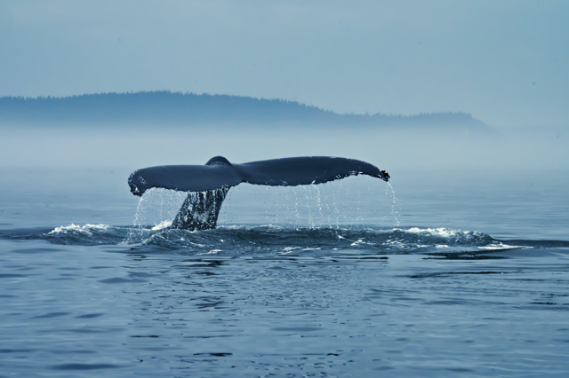

<h1 align="center"> 
Welcome to my GitHub!</h1>

    My name is Colby Kauk

>I'm a driven *full-stack web developer* and recent graduate from Coding Dojo with proficiency in __Python, Java, React/Node.js.__ Trained using __MySQL and mongoDB__

## I enjoy coding. 

### I believe that I can make the world a better place
### I believe that I can get a little better everyday
#### I love challenges
#### I love finding solutions
#### I love learning new languages
#### I love working on teams
#### I enjoy living in different countries

Other hobbies:

  

- Handstands 
- Juggling
- Spinning poi
- Playing music
- Personal fitness: HIIT, HOT ROOM, BARRY'S, PELETON
- I love listening to books and learning about the human brain, particularly its biases and shortcomings

# I am here to code.
<h2 style="padding-top: 20px; text-decoration: underline">GitHub Statistics</h2>

    
    

 
 

<h2 style="text-decoration: underline">Contact Me:</h2>

    
    
    

